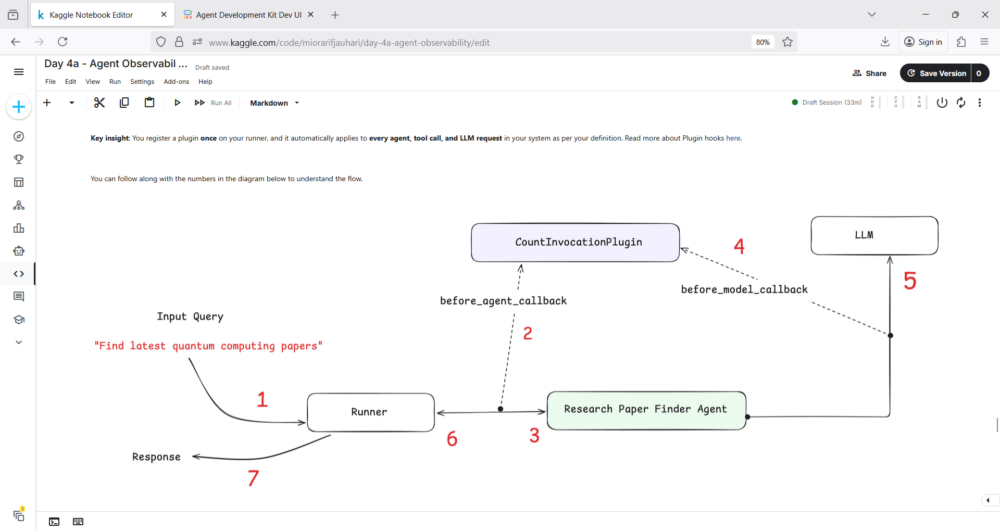
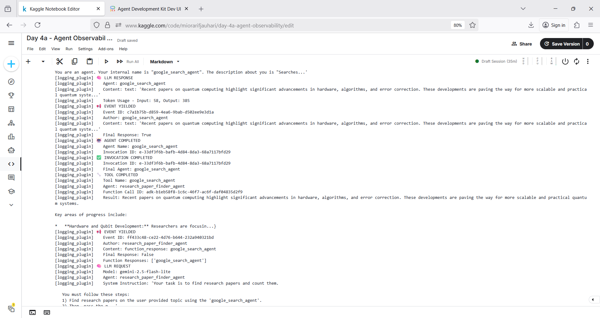
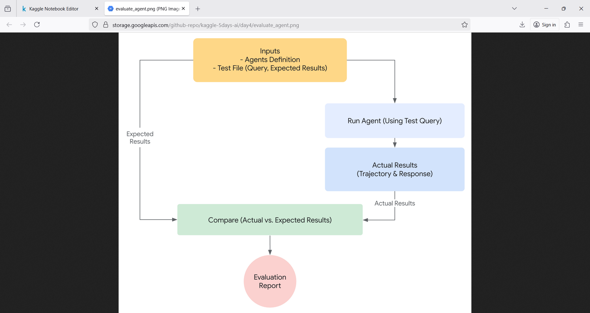
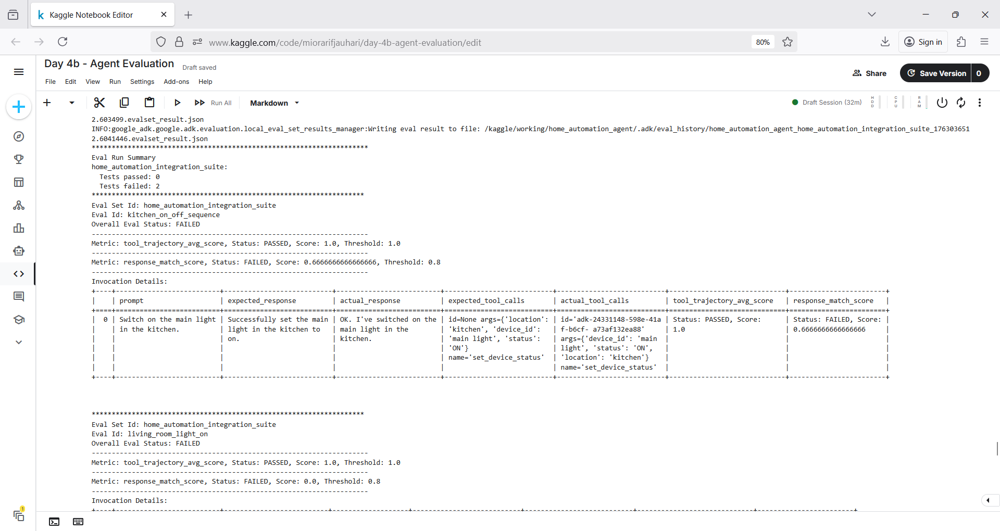
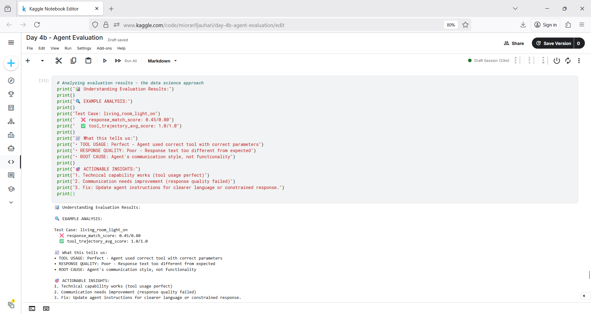

# aiaic_quality 🧑‍🏭⛲📈
aiaic_quality : Agent Quality # Evaluation strategy # Logging # Tracing # Visibility # Metric

## Objective
- Understand what agent evaluation is and how to use it
- Run evaluations and analyze results directly in the ADK web UI
- Detect regression in the agent's performance over a period of time
- Understand & create the necessary evaluation files (*.test.json, *.evalset.json, test_config.json).
- Set up logging configuration
- Create a broken agent. Use adk web UI & logs to identify exactly why the agent fails
- Understand how to implement logging in production
- Learn when to use built-in logging vs custom solutions

## AI Agent Quality

[Agent Observability](./src/4a_observe)

[Agent Evaluation](./src/4b_eval)
